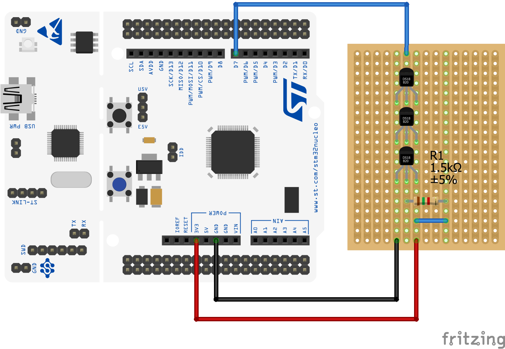

# DS18B20 sensor library

This library aims to provide fast and non-blocking ways of communicating with Dallas DS18B20 temperature sensors which has been achieved using
multiple finite state machines for different sensor states, which allowed to completely avoid delays.

## Getting started

Include both ds18b20.h and onewire.h headers into the project and initialize both One Wire and DS18B20 modules using following functions:

	OneWire onewire = {0};
	DS18B20 ds = {0};
	
	onewireInit(&onewire, 1, &dsSetPinDir, &dsSetPinState, &dsGetPinState, &dsStartTimer, &dsGetTimer);
	ds18b20Init(&ds, &onewire);
	
`onewireInit` function requires five callback functions to provide basic GPIO and timer functionality:

Parameter								| Description
----------------------------------------|-----------------------------------------------
OneWire_SetPinDirection setPinDir		| Set GPIO direction to either input or output
OneWire_SetPinState setPinState			| Set GPIO state to either high or low
OneWire_ReadPin readPin					| Read GPIO value
OneWire_StartTimer startTimer			| Start timer and set timer's counter to zero
OneWire_ReadTimer readTimer				| Read timer's value

Once both modules are initialized, a timer must be initialized to work with 1us frequency. This timer will be used to assert timing 
for sensor's communication functions and will be used via `startTimer` and `readTimer` callbacks specified in `onewireInit` function.

After the initialization is done, it is required to call `ds18b20Process` function in program's main loop. This function handles 
internal state machine operations automatically.

In order to start temperature conversion, one must call `ds18b20BeginConversion` function when library state is either `DS18b20_State_Idle`
or `DS18b20_State_Finished`. State can be checked directly from DS18B20 structure, or as a result of calling `ds18b20Process` function.

After calling any command function on the DS18B20 structure, the library will begin processing the command, and upon completion will call 
`onOperationFinished` callback and change it's `state` field to `DS18b20_State_Finished` which signals the user that next operation may be
executed.

## Workflow

In order to make usage of the library easier, it is adviced to specify `onOperationFinished` callback to enable the library to notify user
whenever an operation has been finished. The callback function takes the following form:

	void dsFinished(DS18B20 *ds, DS18b20State operation, DS18B20_Address addr, DS18B20CallbackFlags flags)
	
The callback is registered directly on the DS18B20 structure like `ds.onOperationFinished = &dsFinished;`.

#### Simple example using onOperationFinished callback

	double temperature;
	
	// ...

	void dsFinished(DS18B20 *ds, DS18b20State operation, DS18B20_Address addr, DS18B20CallbackFlags flags)
	{
		if (operation == DS18b20_State_Convert) // When conversion is complete begin reading the scratchpad
			ds18b20ReadScratchpad(ds, addr);
		else if (operation == DS18b20_State_ReadScratchpad) // When scratchpad is read, obtain the temperature
			temperature = ds18b20GetTemperatureFloat(ds);
	}
	
	// ...
	
	OneWire onewire = {0};
	DS18B20 ds = {0};
	
	// Initialize modules
	onewireInit(&onewire, 1, &dsSetPinDir, &dsSetPinState, &dsGetPinState, &dsStartTimer, &dsGetTimer);
	ds18b20Init(&ds, &onewire);
	
	// Install callback
	ds.onOperationFinished = &dsFinished;
	
	while (1)
	{
		// Process FMS
		DS18b20State state = ds18b20Process(&ds);
	
		if (state == DS18b20_State_Finished || state == DS18b20_State_Idle)
		{
			// When module is idle or finished - begin conversion
			ds18b20BeginConversion(&ds, DS18B20_ROM_NONE);
		}
	}

## Examples

More examples can be found in `example/` directory, which for now contains only working example for the sensor designed for STM32F103RB microcontrollers, however this library was created with the thought of allowing high adaptability in mind, therefore porting it only requires changing the five callback functions mentioned earlier to match target architecture.

## Wiring

## Credits

`ds18b20CheckAuthentic` function used to check if sensor is genuine has been created thanks to description at [this repo](https://github.com/cpetrich/counterfeit_DS18B20).

[DS18B20 datasheet](https://datasheets.maximintegrated.com/en/ds/DS18B20.pdf) contains all the information about the sensor.

## License

[MIT](LICENSE)
